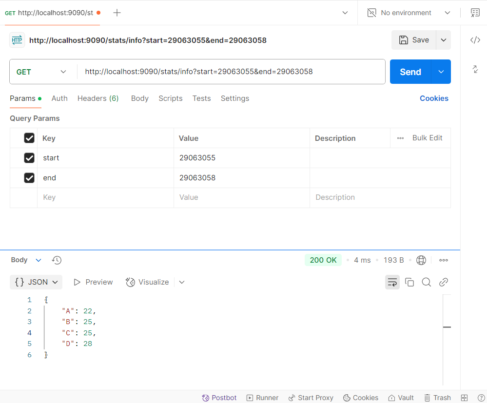

# 编程实践题 6
## 题目描述
1. 安装emqx软件包，搭建测试用MQTT Broker。
2. 撰写一个模拟数据发送程序，可以向MQTT Broker的topic发送一批至少100条JSON消息。
   1. 消息体含两个关键字段，timestamp和type。
   2. timestamp值须为发送时刻前后30秒的一个随机时间，秒单位；
   3. type有A、B、C、D 四种类型。
3. 撰写一个订阅MQTT Broker相应topic接收消息的程序。
   1. 该程序接收消息，并用自行设计的数据结构进行内存存储。
   2. 该程序提供一个RESTFUL的API 接口。
   1 入参为开始时间和结束时间，分钟单位。
   2 返回值为一个json实体，返回入参时间单位内的ABCD条数分别为多少。

## 问题解答
### 环境搭建
1. 我在本地使用了VMware虚拟机搭建了一个Cent OS系统，并在该系统上通过docker安装了emqx。
```shell
docker run -d --name emqx -p 1883:1883 -p 8083:8083 -p 8084:8084 -p 8883:8883 -p 18083:18083 emqx/emqx:5.8.6
```
2. 搭建一个Maven工程，主要使用了使用了SpringBoot框架、spring-integration-mqtt包，fastjson以及lombok，本项目模块结构如下：
- message-models  # 存放消息实体类
- services
  - message-consumer  # 模拟消息接收方
  - message-producer  # 模拟消息发送方

### 过程复现
1. 先启动message-consumer中的`ComsumerApplication.java`
2. 再启动message-producer中的`ProducerApplication.java`
3. 通过postman测试，接口地址为`http://localhost:9090/stats/info?start=29063055&end=29063058`，请求方法为GET，根据实际时间修改start参数和end参数
</img>

### 设计思路
1. message-models模块中定义了消息实体类`Message`，包含`timestamp`和`type`两个属性，之后发送消息和接收消息都会使用到这个类。
2. message-producer模块：
   1. 定义了`MQTTClientUtil`类，包含了消息发送方的建立连接、关闭连接、发送消息等操作。
   2. 在`Producer`中定义了发送n条指定消息的`send`方法。
   3. 启动类实现了`CommandLineRunner`接口，重写`run`方法，在项目启动时去调用`Producer`的`send`方法。
3. message-consumer模块：
   1. 定义了`DataStorage`类，用于存储接收到的消息，具体使用`CopyOnWriteArrayList`类存消息，可以保证线程安全；还定义了`getStatistics`方法，可以根据起止时间统计不同类型消息的数量。
   2. 定义了`Consumer`类，包含了消息接收方的建立连接、关闭连接、订阅主题等操作。
   3. `MessageCallbackListener`是`Consumer`订阅主题时的消息回调监听类，实现了`IMqttMessageListener`类，重写`messageArrived`方法，当订阅主题中有消息时触发此消息，将消息存到`DataStorage`中。
   4. 最后定义了一个接口类`StatsController`，`getStats`方法即为题目要求实现的接口方法，参数为以分钟为单位的起止时间。
4. 消息发送方和消息接收方的配置参数都写在配置文件中，搭配配置类使用。
5. 更为具体的实现，请参考代码中的注释与日志记录代码。


  
